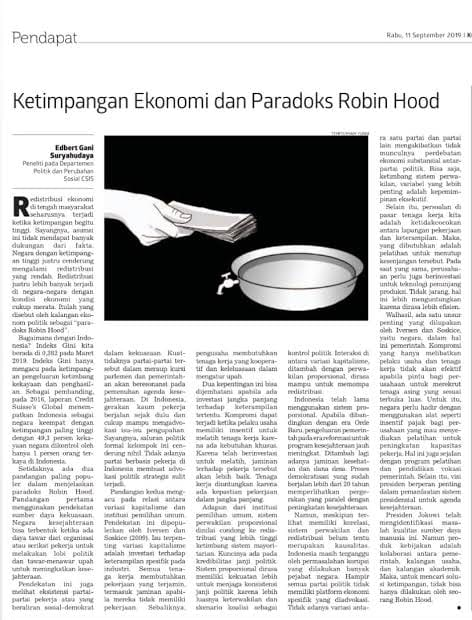

# Lab7Web

Setiap controller akan me-load tampilan yang menggunakan layout utama (template), agar semua halaman punya desain yang konsisten (navbar, sidebar, footer sama).

Contoh:

// Controller: Page.php
public function about()
{
    return view('about', ['judul' => 'Tentang Kami']);
}
Di View (misal: about.php),bisa extend layout:

<?= $this->extend('layout/template'); ?>
<?= $this->section('content'); ?>
<h1><?= $judul ?></h1>

Ini adalah halaman tentang kami.

<?= $this->endSection(); ?>

# Modul Praktikum 1

## Deskripsi

Latihan membuat layout sederhana menggunakan CodeIgniter 4. Semua halaman seperti Home, About, Artikel, dan Kontak akan menggunakan layout yang sama dengan header dan footer tetap.

## Langkah-langkah 

1. Membuat controller Page.php
2. Membuat file layout di Views/layout/template.php
3. Membuat halaman home.php, about.php, dll dengan extend layout
4. Menambahkan routing di Config/Routes.php

# Modul Praktikum 2

Ringkasan Instruksi:
Menghapus Data
Tambahkan method delete() ke dalam Controller Artikel: 

public function delete($id)
{
    $artikel = new ArtikelModel();
    $artikel->delete($id);
    return redirect('admin/artikel');
}

# Pertanyaan dan Tugas

Selesaikan program sesuai langkah-langkah yang diberikan.

Diperbolehkan melakukan improvisasi.

 

# Modul Praktikum 3 

# 1.File View Cell (app/View/components/artikel_terkini.php)

<?php
// Menampilkan artikel terkini dengan kategori tertentu
foreach ($artikel as $row): ?>
    

        <a href="<?= base_url('/artikel/' . $row['slug']) ?>">
            <h3><?= $row['Ketimpangan Ekonomi Dan Paradoks Robin Hood'] ?></h3>
        </a>
        
Kategori: <?= $row['kategori'] ?>

    

<?php endforeach ?>

# 2.Output yang Diharapkan (Contoh Visual)
Keterangan Output:

Setiap artikel ditampilkan dalam bentuk card dengan:

Judul artikel (link ke detail)

Nama kategori

Hanya menampilkan artikel dengan kategori "terkini".

3. Contoh Data dari Controller/Model (PHP)

// Contoh data yang dikirim ke View Cell
$data = [
    'artikel' => [
        [
            'judul' => 'Belajar CodeIgniter 4',
            'slug' => 'belajar-ci4',
            'kategori' => 'terkini'
        ],
        [
            'judul' => 'View Cell dalam CI4',
            'slug' => 'view-cell-ci4',
            'kategori' => 'tutorial'
        ]
    ]
];

# 3.Perbedaan View Cell vs View Biasa

Fitur	View Cell	View Biasa
Scope	Komponen kecil (sidebar, widget)	Halaman penuh (index, detail)
Reusability	✅ Bisa dipakai di banyak halaman	❌ Spesifik per-halaman
Logika	Minimal (fokus tampilan)	Bisa kompleks

# 4.Catatan penting

Pastikan menggunakan CodeIgniter 4 (terlihat dari struktur folder app/View/components).

Format output bisa disesuaikan dengan CSS (contoh: Bootstrap).

Untuk gambar asli, Anda perlu menjalankan kode di lokal dan screenshot hasilnya.

 

# Modul Praktikum 4

Bahasa pemrograman yang digunakan pada cuplikan modul tersebut adalah PHP, lebih tepatnya menggunakan framework CodeIgniter, yang terlihat dari gaya penulisan fungsi dan session handling-nya seperti ini:

public function logout()
{
    session()->destroy();
    return redirect()->to('/user/login');
}

Penjelasan Kode:

public function logout() → Mendefinisikan method logout dalam sebuah controller di PHP (biasanya pada controller User).

session()->destroy(); → Menghapus semua data sesi (session), artinya pengguna akan "logout".

return redirect()->to('/user/login'); → Mengarahkan (redirect) pengguna ke halaman login setelah logout.

Output Program:

Jika kode ini dijalankan dan pengguna mengakses fungsi logout, maka hasil/output-nya adalah:

Session pengguna akan dihapus (logout).

Pengguna langsung dialihkan ke halaman login, yaitu URL: /user/login.

Outputnya biasanya berupa halaman form login seperti gambar "Sign In" yang ditampilkan di modul (Gambar 13.4), dengan kolom:

• Email address

• Password

• Tombol Login

# Modul Praktikum 5

Bahasa pemrograman yang digunakan pada modul di gambar tersebut adalah PHP dengan framework CodeIgniter 4, dikombinasikan dengan HTML untuk bagian form pencarian.

Penjelasan Kode:
Form Pencarian (HTML + PHP):

<form method="get" class="form-search">
    <input type="text" name="q" value="<?= $q; ?>" placeholder="Cari data">
    <input type="submit" value="Cari" class="btn btn-primary">
</form>

method="get" → Data dikirim lewat URL.

name="q" → Input pencarian dengan nama q.

value="<?= $q; ?>" → Menampilkan nilai input terakhir.

placeholder="Cari data" → Teks bantu dalam kotak input.

Paging dengan Query:

<?= $pager->only(['q'])->links(); ?>

Digunakan untuk menampilkan navigasi halaman (pagination), sambil tetap membawa parameter pencarian (q).

Output Program:
Outputnya adalah halaman Admin Portal Berita dengan fitur pencarian artikel. Ketika pengguna mengetik kata kunci di form lalu klik tombol "Cari", maka:

1.Daftar artikel akan difilter sesuai kata kunci yang dimasukkan.

2.Tabel menampilkan hasil pencarian dengan kolom:

ID

Judul artikel

Status

Tombol Aksi (Ubah, Hapus)

3.Navigasi halaman (pagination) tetap mempertahankan kata kunci pencarian.

Contoh output tampak pada gambar sebagai tabel data hasil pencarian di halaman /admin/artikel.

# Modul Praktikum 6

Pada gambar dari Modul Praktikum 6 tersebut, bahasa pemrograman yang digunakan adalah:

Bahasa Pemrograman:

PHP (menggunakan framework CodeIgniter 4)

HTML (untuk pembuatan form upload)

Kode form HTML yang terlihat:

<form action="" method="post" enctype="multipart/form-data">
    
Penjelasan Kode:

method="post" → Mengirim data ke server menggunakan metode POST.

enctype="multipart/form-data" → Wajib digunakan untuk upload file.

Terdapat input file di dalam form, digunakan untuk mengunggah gambar.

Output Program:

Output dari kode dan pengaturan ini adalah halaman Tambah Artikel di aplikasi Admin Portal Berita yang berfungsi untuk meng-upload file gambar. Berikut hasil akhirnya:

1.Formulir untuk mengisi artikel baru.

2.Terdapat input file untuk mengunggah gambar.

3.Setelah file dipilih dan tombol “Kirim” ditekan, gambar akan dikirim ke server dan disimpan, misalnya ke folder uploads/ di server.

Tampilan output terlihat pada gambar di bawah form, yaitu halaman localhost:8080/admin/artikel/add.
