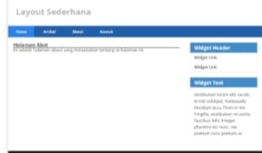

# Lab7Web

Setiap controller akan me-load tampilan yang menggunakan layout utama (template), agar semua halaman punya desain yang konsisten (navbar, sidebar, footer sama).

Contoh:

// Controller: Page.php
public function about()
{
    return view('about', ['judul' => 'Tentang Kami']);
}
Di View (misal: about.php),bisa extend layout:

<?= $this->extend('layout/template'); ?>
<?= $this->section('content'); ?>
<h1><?= $judul ?></h1>

Ini adalah halaman tentang kami.

<?= $this->endSection(); ?>

# Modul Praktikum 1 - Pemrograman Web 2

## Deskripsi

Latihan membuat layout sederhana menggunakan CodeIgniter 4. Semua halaman seperti Home, About, Artikel, dan Kontak akan menggunakan layout yang sama dengan header dan footer tetap.

## Langkah-langkah 

1. Membuat controller Page.php
2. Membuat file layout di Views/layout/template.php
3. Membuat halaman home.php, about.php, dll dengan extend layout
4. Menambahkan routing di Config/Routes.php

# Modul Praktikum 2-Pemrograman Web 2 

Ringkasan Instruksi:
Menghapus Data
Tambahkan method delete() ke dalam Controller Artikel: 

public function delete($id)
{
    $artikel = new ArtikelModel();
    $artikel->delete($id);
    return redirect('admin/artikel');
}

# Pertanyaan dan Tugas

Selesaikan program sesuai langkah-langkah yang diberikan.

Diperbolehkan melakukan improvisasi.

# Laporan Praktikum

Langkah-langkah membuat laporan:

Lanjutkan praktikum sebelumnya pada repository bernama Lab7Web.

Kerjakan latihan sesuai urutan.

Screenshot setiap perubahan.

Update file README.md dengan penjelasan langkah dan screenshot.

Commit hasil ke repository masing-masing.

Kirim URL repository ke e-learning (ecampus).

 

